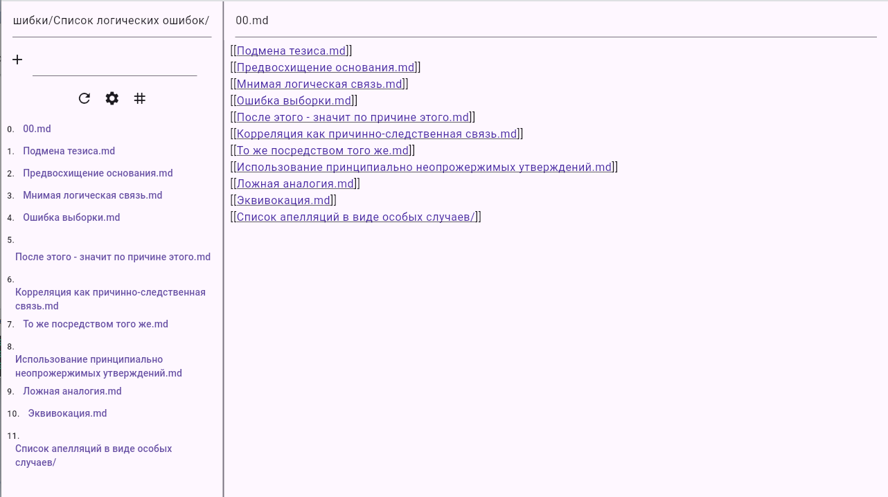

Hey! This app created from DataMining like Zettelkasten.  
Features list:  
Priority File: In this file you specify which links should be added to the beginning of the list of elements  
Cancel folder sorting in start  
Add '#', '##', '#\d+' to '../'  
Add Path Separator and with this separator is used to mark files at the end  

For donats:  
0xE683392f477B278dE6ce03198BFdf9c3E01EAc6D  

Russian screenshot reworking article wiki
original: https://ru.wikipedia.org/wiki/%D0%9B%D0%BE%D0%B3%D0%B8%D1%87%D0%B5%D1%81%D0%BA%D0%B0%D1%8F_%D0%BE%D1%88%D0%B8%D0%B1%D0%BA%D0%B0  
link: https://boosty.to/vosirandr/posts/747d9d09-87d4-462e-b2ef-772e6d0a7885?share=post_link  
  

